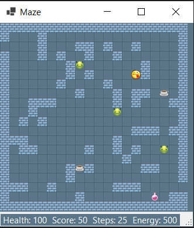

# Maze!

- Лекарства, кофе, энергия, шаги, очки, проверки:
- - Здоровье персонажа не может быть более 100%, то есть, если здоровье уже на максимуме, то лекарство нельзя подобрать.
- - Чашку кофе нельзя выпить, если персонаж совершил менее 10 перемещений с момента принятия лекарства.
- - Проверки на смерть (нет хп, нет энергии)
- - Проверка на то есть ли враги в лабиринте (если нет - победа)

